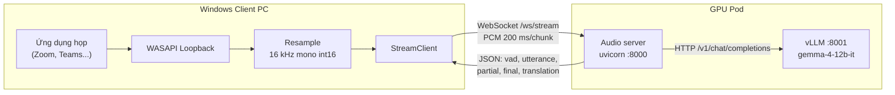
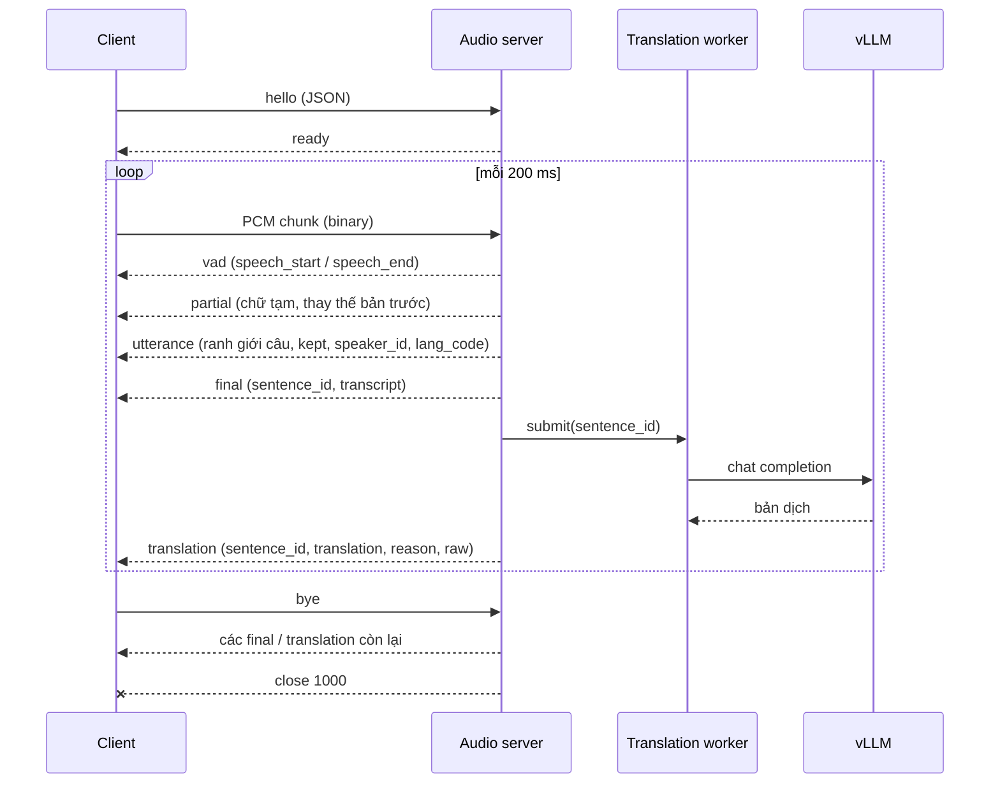
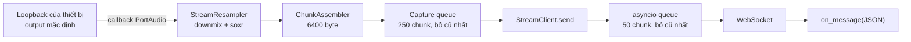
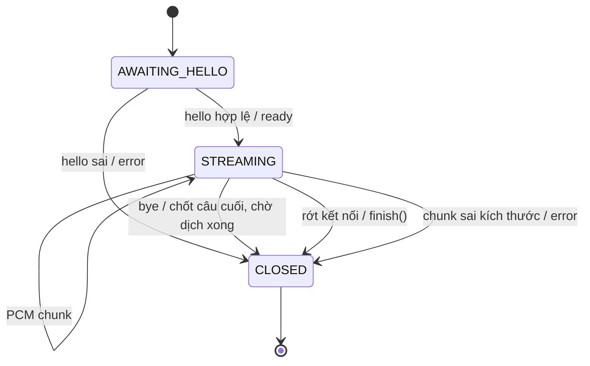
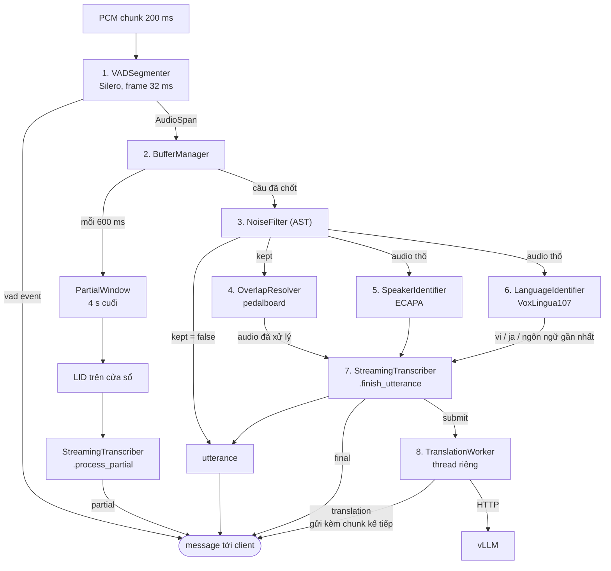
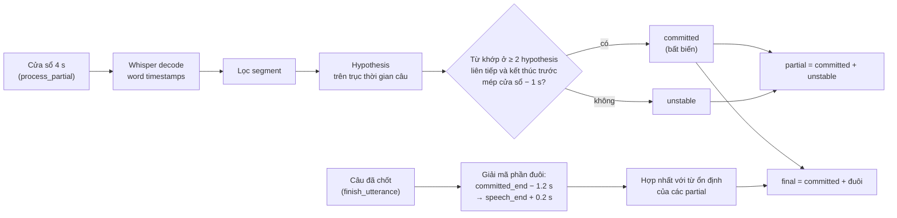
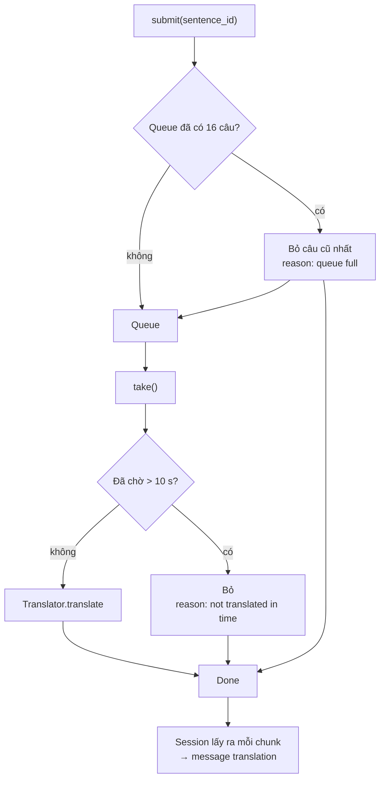
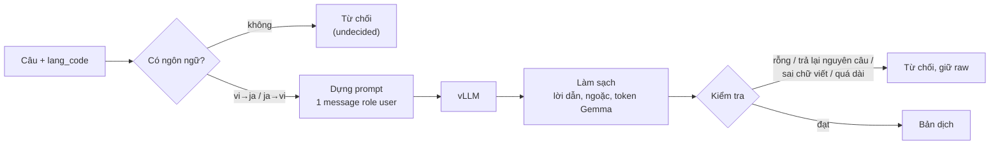

# Kiến trúc hệ thống: Realtime VI-JA Meeting Translator

Tài liệu mô tả kiến trúc theo source code hiện tại. Mọi tham số lấy từ
`server/config.py`, `client/config.py` và `common/protocol.py`.

## 1. Tổng quan

Phiên dịch hai chiều Việt ↔ Nhật cho cuộc họp online, thời gian thực.
Toàn bộ mã nguồn là Python 3.11.

| Thành phần | Chạy trên | Vai trò |
|---|---|---|
| `client/` | Windows Client PC | Thu âm loopback, chuyển về 16 kHz mono, stream lên server |
| `server/` | GPU Pod (H100 80GB) | VAD, tách câu, lọc nhiễu, nhận diện người nói và ngôn ngữ, ASR, điều phối dịch |
| vLLM | Cùng GPU Pod, tiến trình riêng | Phục vụ `google/gemma-4-12b-it` qua API OpenAI-compatible |
| `common/protocol.py` | Cả hai phía | Định nghĩa duy nhất của giao thức và định dạng audio |



## 2. Giao thức (`common/protocol.py`)

- Một kết nối WebSocket cho mỗi phiên họp: `ws://<host>:8000/ws/stream`.
- **Binary frame** (client → server): đúng 6400 byte PCM 16-bit LE, mono, 16 kHz (200 ms), không header.
- **Text frame**: JSON, cả hai chiều.
- `hello` phải khai báo đúng `protocol_version`, `sample_rate`, `channels`, `sample_width`, `chunk_ms`. Lệch bất kỳ trường nào thì server trả `error` và đóng.
- Server phục vụ **một phiên tại một thời điểm**. Kết nối thứ hai nhận `error` rồi bị đóng với code 1013.



| Message | Chiều | Nội dung chính |
|---|---|---|
| `hello` | C → S | `session_id`, định dạng audio, tên client |
| `bye` | C → S | `reason` |
| `ready` | S → C | `session_id`, `sample_rate`, `chunk_bytes` |
| `vad` | S → C | `event`, `at_ms` (tính từ mẫu đầu tiên của phiên) |
| `utterance` | S → C | `index`, `start_ms`, `end_ms`, `reason`, `continues_previous`, `kept`, `label`, `speech_score`, `speaker_id`, `lang_code` |
| `partial` | S → C | `lang_code`, `transcript` (chữ đã chốt + chữ chưa ổn định) |
| `final` | S → C | `sentence_id`, `speaker_id`, `lang_code`, `transcript`, `speech_score` |
| `translation` | S → C | `sentence_id`, `translation`; khi không dịch được thì `translation` rỗng, kèm `reason` và `raw` |
| `error` | S → C | `message`, `fatal` |

`sentence_id` tăng dần trong một phiên và không lặp. Nó là khoá để ghép
`translation` với `final`.

## 3. Client (`client/`)



| Module | Trách nhiệm |
|---|---|
| `audio/capture.py` | `LoopbackCapture`: chọn loopback của output mặc định (hoặc theo tên), thử format `int16` → `float32` → `int32`. Callback không bao giờ chặn; queue đầy thì bỏ chunk cũ nhất. |
| `audio/resampler.py` | Downmix về mono, resample về 16 kHz bằng `soxr` (giữ trạng thái filter giữa các chunk), fallback `scipy.resample_poly`. |
| `net/ws_client.py` | `StreamClient`: bắt tay `hello`/`ready`, gửi và nhận song song. Tự kết nối lại với backoff 0.5 → 10 s, ping 20 s. Audio lúc mất kết nối bị bỏ, không phát lại. Khi dừng: gửi `bye` và nghe thêm 2 s để nhận các message cuối. |
| `config.py` | Re-export hợp đồng audio từ `common/protocol.py`. |

Client không lọc audio, kể cả khoảng lặng (~256 kbps) và không chứa ML.
Thư mục `client/ui` hiện còn trống; luồng end-to-end đang chạy qua
`client/tests_real/test_real_stream.py`.

## 4. Server (`server/`)

### 4.1 Tiến trình và vòng đời

- `server/app.py` (FastAPI) nạp mọi model một lần lúc khởi động: Silero, AST, ECAPA, VoxLingua, Whisper, và kết nối vLLM.
- Silero bắt buộc: nạp lỗi thì server không khởi động. Các model còn lại nạp lỗi thì server vẫn chạy, chỉ thiếu tầng đó. `/health` báo trạng thái và lỗi của từng model.
- `server/net/session.py` (`ServerSession`) chứa toàn bộ logic phiên, đồng bộ. Mỗi hàm trả về danh sách message cần gửi, nên unit test chạy được mà không cần socket hay GPU.



Thứ tự khởi động trên pod: **vLLM trước** (`python3.11 server/launch_vllm.py`),
sau đó audio server (`python3.11 -m uvicorn server.app:app --host 0.0.0.0 --port 8000`).
Lý do: vLLM giữ 85% bộ nhớ GPU ngay lúc khởi động.

### 4.2 Pipeline xử lý

Mỗi chunk đi qua VAD rồi Buffer Manager. Mỗi câu đã chốt chạy tuần tự các
tầng trên luồng đọc socket. Riêng phần dịch chạy ở thread riêng.



| # | Tầng | Module | Chính sách |
|---|---|---|---|
| 1 | VAD | `pipeline/vad.py` | Silero v5, frame 512 mẫu. Mở segment khi xác suất ≥ 0.5 liên tục 96 ms; đóng khi < 0.35 trong 500 ms. Pre-roll 256 ms để không mất âm đầu. |
| 2 | Buffer Manager | `pipeline/buffer.py` | Chốt câu khi VAD đóng segment (`pause`), khi dài quá 7 s (`max_duration`, cắt tại frame 32 ms yên nhất trong 500 ms cuối, phần sau có `continues_previous`), hoặc khi hết phiên (`end_of_stream`). Mỗi 600 ms phát một `PartialWindow`. |
| 3 | Noise Filter | `pipeline/noise.py` | AST `MIT/ast-finetuned-audioset-10-10-0.4593`, cửa sổ 10 s. Chỉ bỏ câu khi speech < 0.2 **và** một nhãn non-speech ≥ 0.3. Câu bị bỏ vẫn gửi `utterance` với `kept: false`. |
| 4 | Overlap Resolver | `pipeline/overlap.py` | Noise gate (ngưỡng = peak P90 − 12 dB, ratio 4) rồi compressor (peak + 3 dB, ratio 3). Bỏ qua câu có mức ≤ −55 dBFS. Chỉ audio cho ASR đi qua tầng này. |
| 5 | Speaker ID | `pipeline/diarization.py` | ECAPA `speechbrain/spkrec-ecapa-voxceleb` trên audio thô. Cosine ≥ 0.30 thì khớp người đã biết (centroid momentum 0.7), không thì tạo `Speaker_NN`, tối đa 12 người. Câu < 600 ms gắn `Speaker_unknown`. |
| 6 | Language ID | `pipeline/lid.py` | VoxLingua107 ECAPA, chỉ so `vi` với `ja`. Chênh lệch < 0.30 hoặc câu < 600 ms thì coi là chưa rõ; khi đó session dùng ngôn ngữ chắc chắn gần nhất của phiên. |
| 7 | ASR | `pipeline/asr.py` | faster-whisper `large-v3` (CUDA float16 / CPU int8), xem 4.3. |
| 8 | Dịch | `pipeline/translation_queue.py`, `pipeline/translate.py` | Xem 4.4 và 4.5. |

Mỗi tầng được đo thời gian. Câu chiếm socket > 1 s bị ghi log kèm tên tầng
chậm nhất. Lỗi trong pipeline chỉ làm mất câu đó, không đóng kết nối.

### 4.3 ASR streaming (`StreamingTranscriber`)

Whisper không phải model streaming. Module này giải mã lặp lại rồi ổn định
kết quả thành văn bản chỉ nối thêm (append-only).



- **Tham số giải mã:** `temperature` 0, `beam_size` 1, `condition_on_previous_text` tắt, `vad_filter` tắt (Silero đã chạy ở đầu), `word_timestamps` bật.
- **Segment bị loại** khi:
  - `no_speech_prob` > 0.6 và `avg_logprob` < −1.0;
  - `no_speech_prob` > 0.95;
  - `avg_logprob` < −1.0;
  - `compression_ratio` > 2.4 (câu lặp);
  - khớp danh sách câu Whisper hay bịa (`ASR_HALLUCINATIONS`, `ASR_HALLUCINATION_PATTERNS`).
- **Khớp từ giữa các cửa sổ:** so văn bản đã chuẩn hoá, sai lệch thời gian ≤ 0.45 s.
- **Khi hợp nhất phần cuối:** từ đã ổn định qua nhiều partial được ưu tiên hơn bản giải mã cuối nếu hai bên mâu thuẫn. Từ nằm sau `speech_end` bị bỏ.
- Câu bị Noise Filter loại thì trạng thái ASR của câu đó bị huỷ (`cancel_utterance`).

### 4.4 Hàng đợi dịch (`TranslationWorker`)

`final` được gửi ngay khi ASR xong. Việc dịch chạy trên thread riêng, nên
socket không bao giờ phải chờ LLM.



- Mọi câu đều nhận đúng một message `translation`, kể cả khi bị bỏ (khi đó có `reason`).
- Khi phiên kết thúc (`bye` hoặc rớt kết nối): worker dịch nốt các câu còn trong queue (tối đa 2 s), câu nào còn lại thì trả `reason: the meeting ended before this was translated`.
- Lịch sử hội thoại được lưu ngay khi câu được chốt, kể cả khi bản dịch của nó sau đó bị bỏ.

### 4.5 Dịch (`Translator`, `VllmClient`)



**Prompt.** Gemma không có role `system`, nên request chỉ có một message
`user`: dòng đầu là chỉ thị, dòng cuối là câu cần dịch.

```text
Bạn là một trợ lý phiên dịch trực tiếp. Hãy dịch câu tiếng Nhật sau sang tiếng Việt một cách tự nhiên và chính xác nhất. Chỉ trả về kết quả dịch, không giải thích thêm:

<câu cần dịch>
```

Khi đã có câu trước đó, tối đa 3 câu gần nhất được chèn giữa chỉ thị và câu
cần dịch, dưới tiêu đề "chỉ để tham khảo ngữ cảnh, không dịch". Kiểu mặc định
`sources` chỉ đưa câu gốc kèm người nói, không kèm bản dịch, để model không bắt
chước ngôn ngữ của các bản dịch cũ.

**Kiểm tra câu trả lời:**

| Kiểm tra | Điều kiện từ chối |
|---|---|
| Rỗng | Sau khi làm sạch không còn gì |
| Trả lại nguyên câu | Giống câu gốc khi bỏ dấu câu và khoảng trắng |
| Sai chữ viết | Tỉ lệ kana/kanji < 0.30 khi dịch sang `ja`, > 0.30 khi dịch sang `vi` |
| Quá dài | Dài hơn `len(câu gốc) × hệ số + 50` ký tự; hệ số 2.0 khi dịch sang `vi`, 1.0 khi sang `ja` |

**Tham số request:** `temperature` 0.1, `top_p` 0.95, `seed` 0,
`stop` `["<end_of_turn>", "<eos>"]`, `max_tokens` 512, timeout 20 s.

Lúc kết nối, client đọc `/v1/models` và từ chối nếu server không phục vụ đúng
`TRANSLATE_MODEL`; cảnh báo nếu `max_model_len` khác 4096.

## 5. Triển khai vLLM

`server/launch_vllm.py` dựng lệnh khởi động từ `server/config.py`:

```bash
python3.11 -m vllm.entrypoints.openai.api_server \
    --model google/gemma-4-12b-it --port 8001 --dtype bfloat16 \
    --max-model-len 4096 --gpu-memory-utilization 0.85 --trust-remote-code
```

| Tham số | Giá trị | Lý do |
|---|---|---|
| `dtype` | `bfloat16` | Gemma chạy float16 cho ra output rác hoặc NaN |
| `max_model_len` | 4096 | Prompt chỉ vài trăm token; context nhỏ tiết kiệm KV cache |
| `gpu_memory_utilization` | 0.85 | Phần còn lại dành cho Whisper, AST, ECAPA, VoxLingua |
| `trust_remote_code` | `True` | |

Phiên bản ghim: `vllm==0.26.0`, `torch==2.11.0`, `transformers==5.14.1`.
`transformers` từ 5.15 chuyển `head_dim` của Gemma 4 thành thuộc tính riêng
từng layer, và vLLM trước 0.28 không đọc được dạng này.
`server/tests/test_requirements_unit.py` chặn cặp phiên bản lệch đó.

## 6. Cấu trúc thư mục

```text
common/protocol.py          Giao thức và hợp đồng audio dùng chung
client/
  audio/capture.py          WASAPI loopback, chunk 200 ms
  audio/resampler.py        Downmix, resample 16 kHz
  net/ws_client.py          WebSocket, reconnect
  tests/, tests_real/       Unit test; real test chạy trên Windows Client PC
server/
  app.py                    FastAPI, nạp model, /health, /ws/stream
  config.py                 Mọi tham số của pipeline
  launch_vllm.py            Khởi động vLLM
  net/session.py            Máy trạng thái phiên và điều phối pipeline
  pipeline/                 vad, buffer, noise, overlap, diarization, lid,
                            asr, translation_queue, translate
  tests/, tests_real/       Unit test; real test chạy trên GPU Pod
```

## 7. Kiểm thử

| Loại | Vị trí | Chạy trên |
|---|---|---|
| Unit test (model được stub) | `client/tests`, `server/tests`, `common/tests` | Dev PC: `.venv\Scripts\python.exe -m pytest` |
| Real test từng module (có sẵn smoke test cho chính script) | `server/tests_real/test_real_*.py` | GPU Pod |
| Real test thu âm và end-to-end | `client/tests_real/test_real_audio_capture.py`, `test_real_stream.py` | Windows Client PC |
